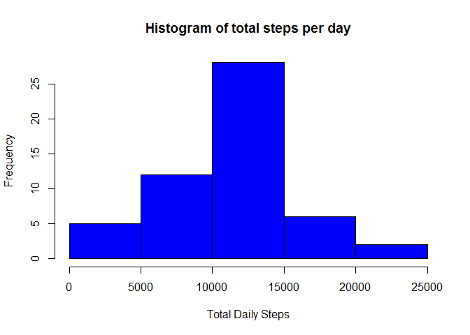
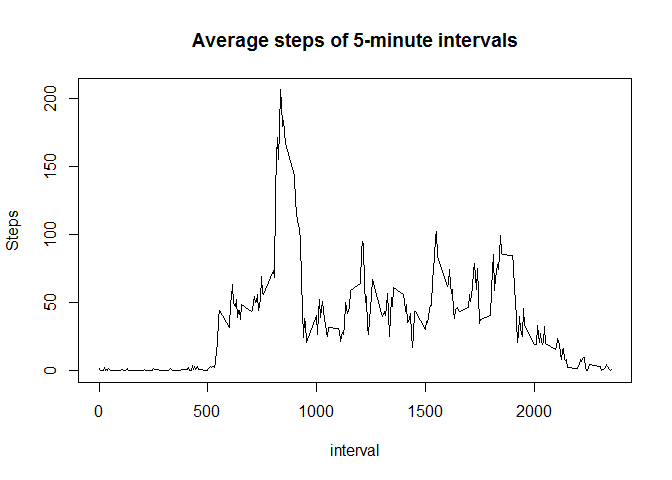
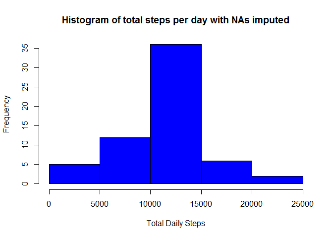
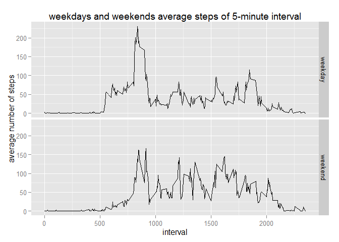

# Reproducible Research: Peer Assessment 1
This document created to complete Peer Assessment 1 of Reproducible Research course.

This document will be divided into multiple parts to help understand the code and generate results.

## Loading and preprocessing the data

#### 1. Download data

The data is downloaded from web [Activity monitoring data](https://d396qusza40orc.cloudfront.net/repdata%2Fdata%2Factivity.zip). Then it is unzipped and loaded into R.


```r
if (!file.exists("./data")) {
  dir.create("./data")
}

if (!file.exists("./data/ActivityMonitoringData")) {
	## Download file
	setInternet2(use = TRUE)
	fileURL <- "https://d396qusza40orc.cloudfront.net/repdata%2Fdata%2Factivity.zip"
	zipfile <- "./data/ActivityMonitoringData.zip"
	download.file(fileURL, destfile=zipfile)
	## Unzip the source file
	unzip(zipfile, exdir = "./data")
	## Remove zipfile
	## file.remove(zipfile)
}
```

#### 2. Load data


```r
## Read Data
data <- read.csv("./data/activity.csv", header = TRUE, stringsAsFactors = FALSE)
```

#### 3. Preprosscessing data

The date column is converted to the Date format.


```r
## Preprocessing Data (convert date into correct format)
data$date <- as.Date(data$date, "%Y-%m-%d")
```

## What is mean total number of steps taken per day?

In this part, NAs are ignored.

#### 1. Calculate the total number of steps taken per day.


```r
library(dplyr)
```

```
## 
## Attaching package: 'dplyr'
## 
## The following object is masked from 'package:stats':
## 
##     filter
## 
## The following objects are masked from 'package:base':
## 
##     intersect, setdiff, setequal, union
```

```r
dailysteps <- data[complete.cases(data), ] %>% group_by(date) %>% summarize(sum(steps, na.rm = TRUE))
colnames(dailysteps) <- c("date", "steps")
```

#### 2. Make a histogram of the total number of steps taken each day.


```r
hist(dailysteps$steps, main = "Histogram of total steps per day", xlab = "Total Daily Steps", col = 'blue')
```

 

#### 3. Calculate and report the mean and median of the total number of steps taken per day.


```r
paste("The mean of the total number of steps taken per day is", mean(dailysteps$steps))
```

```
## [1] "The mean of the total number of steps taken per day is 10766.1886792453"
```

```r
paste("The median of the total number of steps taken per day is", median(dailysteps$steps))
```

```
## [1] "The median of the total number of steps taken per day is 10765"
```

## What is the average daily activity pattern?

#### 1. Make a time series plot (i.e. type = "l") of the 5-minute interval (x-axis) and the average number of steps taken, averaged across all days (y-axis).


```r
intervalsteps <- data %>% group_by(interval) %>% summarize(mean(steps, na.rm = TRUE))
colnames(intervalsteps) <- c("interval", "steps")

plot(intervalsteps$interval, intervalsteps$steps, type = "l", main = "Average steps of 5-minute intervals", xlab = "interval", ylab = "Steps")
```

 

#### 2. Which 5-minute interval, on average across all the days in the dataset, contains the maximum number of steps?


```r
paste("The 5-minute interval, on average across all the days in the dataset, contains the maximum number of steps is", intervalsteps$interval[which.max(intervalsteps$steps)])
```

```
## [1] "The 5-minute interval, on average across all the days in the dataset, contains the maximum number of steps is 835"
```

## Imputing missing values

#### 1. Calculate and report the total number of missing values in the dataset (i.e. the total number of rows with NAs).


```r
## Compute NAs of the original data set
paste("The total number of missing values in the dataset is", nrow(data[!complete.cases(data), ]))
```

```
## [1] "The total number of missing values in the dataset is 2304"
```

#### 2. Devise a strategy for filling in all of the missing values in the dataset.

The strategy used here is the mean for that 5-minute interval.

#### 3. Create a new dataset that is equal to the original dataset but with the missing data filled in.


```r
## Copy the original dataset to a new dataset
dataimputed <- data

## Assign mean of 5-minute interval if steps is NA
for (i in 1: nrow(dataimputed)) {
  if (is.na(dataimputed$steps[i])) {
    dataimputed$steps[i] <- intervalsteps$steps[intervalsteps$interval == dataimputed$interval[i]]
  }
}
```

#### 4. Make a histogram of the total number of steps taken each day and Calculate and report the mean and median total number of steps taken per day. Do these values differ from the estimates from the first part of the assignment? What is the impact of imputing missing data on the estimates of the total daily number of steps?


```r
dailysteps1 <- dataimputed %>% group_by(date) %>% summarize(sum(steps))
colnames(dailysteps1) <- c("date", "steps")

hist(dailysteps1$steps, main = "Histogram of total steps per day with NAs imputed", xlab = "Total Daily Steps", col = 'blue')
```

 

```r
paste("The mean of total number of steps taken per day is", mean(dailysteps1$steps))
```

```
## [1] "The mean of total number of steps taken per day is 10766.1886792453"
```

```r
paste("The median of total number of steps taken per day is", median(dailysteps1$steps))
```

```
## [1] "The median of total number of steps taken per day is 10766.1886792453"
```

The mean of total number of steps taken per day remains the same, the median of total number of steps has changed.

## Are there differences in activity patterns between weekdays and weekends?

This part uses the dataset with the filled-in missing values.

#### 1. Create a new factor variable in the dataset with two levels - "weekday" and "weekend" indicating whether a given date is a weekday or weekend day.


```r
dataimputed$weekday <- ifelse(weekdays(dataimputed$date) %in% c("Saturday", "Sunday"), "weekend", "weekday")
```

#### 2. Make a panel plot containing a time series plot (i.e. type = "l") of the 5-minute interval (x-axis) and the average number of steps taken, averaged across all weekday days or weekend days (y-axis). 


```r
weekdaysteps <- dataimputed %>% group_by(weekday, interval) %>% summarize(mean(steps))
colnames(weekdaysteps) <- c("weekday","interval","steps")

library(ggplot2)

ggplot(weekdaysteps, aes(interval, steps)) + geom_line() + facet_grid(weekday ~ .) + labs(y = "average number of steps") + labs(title = "weekdays and weekends average steps of 5-minute interval")
```

 
